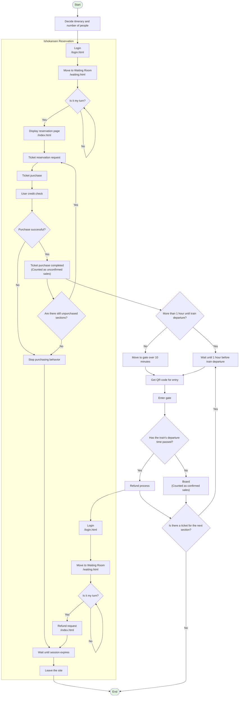

# What is Ishokansen Reservation

The application you have been asked to optimize, Ishokansen Reservation, is a web service for reserving and purchasing bullet train tickets. This web service was developed by railway company staff who are not familiar with software development, and it currently has many problems.

According to the railway company owner, despite having many users who want to use the service, the application's poor performance prevents many users from completing their reservations, causing stagnant sales growth. Your mission is to optimize the application to maximize revenue.

Your evaluation is determined by the sales amount during the 10-hour period from 00:00 to 10:00. In the dream world where you are now, 1 second in the real world corresponds to 10 minutes. In other words, 10 hours in the dream is 1 minute in the real world. Additionally, you can restart from 00:00 at any time with the push of a button. Challenge yourself as many times as you like until you are satisfied with the optimization.

## Route Configuration

Currently, there are 5 stations in operation from Station A to Station E. The stations are named Arena, Bridge, Cave, Dock, and Edge. For simplicity, they will be abbreviated by their first letters. Trains always stop in the order A->B->C->D->E->D->C->B->A. There are no plans to add more stations.

The railway company currently owns 10 trains, and each train has multiple operating schedules throughout the day.
For example, the following schedule is possible:

| Departure Station | Arrival Station | Departure Time |
|-------------------|-----------------|----------------|
| A                 | B               | 08:00          |
| B                 | C               | 08:10          |
| C                 | D               | 08:20          |
| D                 | E               | 08:30          |
| E                 | D               | 08:40          |
| D                 | C               | 08:50          |
| C                 | B               | 09:00          |
| B                 | A               | 09:10          |


Each train is associated with one vehicle model, and the capacity varies by vehicle model.
The railway company currently owns 10 vehicles, but promises you that if ticket sales and revenue are favorable, they will immediately purchase new vehicles and add new operating schedules. The more vehicles and operating schedules there are, the more tickets can be sold, further increasing revenue.

## Overall Flow

The application consists of four main pages:

* Login page (`/login.html`)
* Waiting Room page (`/waiting.html`)
* Reservation page (`/index.html`)
* Admin dashboard page (`/admin.html`)

Ticket purchasers first log in at the login screen and move to the Waiting Room as a measure against access load. In the Waiting Room, they wait their turn, and when their turn comes, they transition to the reservation page.
The reservation page displays a list of currently available operating schedules, and users select and purchase tickets that match their itinerary.

At the same time, railway company staff periodically access the admin dashboard screen to check the number of tickets sold and cumulative sales. When a certain level is exceeded, they purchase new vehicles each time and register those vehicles and their operating schedules from the admin screen.


Below is a flowchart of ticket purchaser behavior.
Detailed parts are omitted for the overall picture explanation. The correct behavior is explained in detail in the "Ticket Purchaser Behavior Details" section below.




# Ticket Purchaser Behavior Details

To maximize revenue, you need to understand how ticket purchasers behave. Below is a detailed explanation of ticket purchaser behavior.


## Itinerary and Reservation Requests

Ticket purchasers have plans for the day and travel 2-5 sections. This is called an itinerary.

```
A -> C -> 2 hour break -> C -> B -> 4 hour break -> B -> E
```

For example, this kind of itinerary is possible. In this example, they travel 3 sections.
When users visit the site, they request tickets that satisfy their itinerary in chronological order from the train list returned by the schedule list (`/api/schedules`).

For example, if the current time is 2:00,
they reserve the earliest train departing from Station A at 2:00 or later. If that train departs from Station A at 2:30 and arrives at Station C at 2:50,
they then search for the earliest train departing from Station C at 4:50 or later and make a reservation. If that train departs from Station C at 5:30 and arrives at Station B at 5:40,
after a 4-hour break, they attempt to reserve a ticket departing from Station B at 9:40 or later. If the train list obtained from the schedule list does not include any trains departing from Station B at 9:40 or later, they stop reserving at that point.
They also stop reserving if the departure time exceeds 24:00.

In this way, they select and reserve the earliest train for each section of the itinerary. If the earliest train is full and sold out, they try to reserve the next train.
If there are no trains in the obtained train list that meet the conditions, they stop reserving at that point.
The same user may log in again, but in that case, they will try to purchase tickets with a different new itinerary from the previous one.

Regarding the number of tickets purchased, there are diverse users including individual travelers, customers purchasing on behalf of their families, and group tour guides, ranging from 1 to 30 tickets.


## Ticket Purchase

When a ticket purchaser makes a reservation request, the application checks with an external payment system whether seats can be secured under those conditions and whether the purchaser has the credit to pay the purchase amount.

Regarding seat reservation, if seats were shown as available in the schedule list but became full before the reservation, the application can recommend a different schedule's seats to the purchaser. When recommended, ticket purchasers will purchase it with an 80% probability. With the remaining 20% probability, they will cancel the purchase and also give up on purchasing tickets for the rest of the itinerary.

Regarding credit verification, each user has a predetermined amount of credit, and if they try to purchase an amount exceeding that, an error will be returned from the payment system.

When a ticket purchase is completed, the ticket is counted as `unconfirmed sales`. As explained below, purchasers may not actually board the train, so it is treated as `unconfirmed sales` until entry.

TODO: Ticket prices


## About Entry

Entry at the gate becomes possible 1 hour before train departure. When that time comes, ticket purchasers enter, and at entry, a request is sent from the ticket gate to `/api/entry`.
Since the gate requires scanning a QR code, purchasers access the QR code image before entry.

If it is already within 1 hour until departure at the time of ticket purchase, they take the same action, but it takes 10 minutes to move to the gate.
If a purchaser purchases a ticket too close to the departure time and cannot make it in time, they cannot board, and then undergo a refund process. Since the responsibility for selling tickets too close to the departure time lies with the application side, refunds must be granted if purchasers request them.

Except for cases where the departure time has passed, purchasers will always board the train.

Upon entry, the sales of that ticket move from `unconfirmed sales` to `confirmed sales`.
These amounts can also be checked from the dashboard for administrators.


## About Refunds

The payment service this application integrates with does not support refunds, so the railway company must bear the refund amount, and refunds should be avoided as much as possible. (See the score calculation method below)

Users request refunds only when they head to the gate immediately after reserving and purchasing a ticket (10-minute travel time) but the train has already departed.
Refunds can be prevented mainly through the following improvements:

* Do not include trains whose departure time is too close to the current time in the train list (response of `/api/scheduled`)
* Optimize the APIs used in the series of processes from reservation to entry


## Score Calculation Method

As explained at the beginning, your evaluation (score) is determined by the sales amount during the 10-hour period from 00:00 to 10:00 (1 minute in the real world). Your evaluation is calculated at 10:00 using the following formula:

```
Score = (Total confirmed sales + Total unconfirmed sales * 0.5 - Total refunds) / 100
```

Your mission is to maximize this score. Not just optimizing the application, but also devising ways to maximize revenue is necessary.

Note that tickets for trains departing by 10:00 will be boarded by ticket purchasers and counted as confirmed sales, but tickets for trains departing after 10:00, even if purchased, will be counted as unconfirmed sales.


# Railway Company Staff Behavior

Railway company staff check the dashboard every 40 minutes (4 seconds in the real world) to check the number of tickets purchased and the total confirmed sales at that time. If it is confirmed to be favorable, new vehicles will be purchased, and those vehicles and multiple schedules associated with them will be registered. All new vehicles are associated with one of the existing vehicle models, and no vehicles of new vehicle models will be added.

Also, if sales are favorable, administrators will also strengthen marketing measures, so more ticket purchasers will visit the site.


# Tips for Developers

Here are some tips from the railway company staff who developed Ishokansen Reservation.

## Testing Functionality

You can log in from `/login.html` and actually check the operation of each screen.

You can log in to the reservation page screen as a ticket purchaser with the `ishocon` user (password: `ishocon`).
You can log in to the admin dashboard screen with the `admin` user (password: `admin`).

At the bottom of the reservation page screen, you can check the list of purchased tickets and manually execute entry processing at the gate or refund processing.


## Resetting Time

When running the benchmark, the `POST /api/initialize` endpoint is called, and the time is reset to 00:00.

Also, within the application, when it becomes 24:00, an `Initialize` button is displayed in the header of the reservation page screen, and you can reset by pressing this button.

You can also execute it by directly hitting the API.

```
curl -X POST http://<host>/api/initialize
```


## Waiting Room Implementation

When access is not concentrated, the Waiting Room redirects to the reservation page screen immediately after login, so it is recommended to try logging in during benchmark execution for operation confirmation.

The Waiting Room settings are controlled by several parameters. In the current implementation, it counts the number of active users staying on the reservation page (`/index.html`), and when that number exceeds a certain threshold, users are made to wait in the Waiting Room. Whether they can enter is checked periodically by polling.
Active user determination is based on the elapsed time since the last action the user took, and the implementation is such that the session expires if nothing is done for a certain period of time.

These parameters, including the polling interval, can be freely changed, and as long as the interface as seen from the client does not change, it is also possible to change the Waiting Room algorithm itself.


## Reservation Algorithm Implementation

To prevent double booking, the logic is implemented to secure seats quite safely. It is highly likely that this is a bottleneck, but since careless changes could cause bugs, only development notes remain and it has been left as is.

Also, regarding recommendation and seat allocation logic, in the current implementation, since a single vehicle never became full, it seems not much thought has been given to it.

By improving these, maximizing revenue may be expected.
