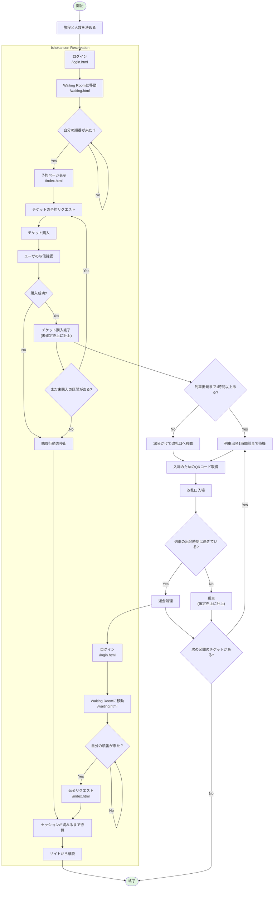

# Ishokansen Reservation とは

あなたが高速化を依頼されたアプリケーション Ishokansen Reservation は、新幹線のチケットを予約、購入できるウェブサービスです。このウェブサービスはソフトウェア開発に詳しくない鉄道会社のスタッフが開発したもので、現在は多くの問題を抱えています。

オーナーの鉄道会社によると、利用したいユーザが多いにもかかわらず、アプリケーションのパフォーマンスが低いために多くのユーザが予約を完了できず、売上が伸び悩んでいるとのことです。あなたのミッションはアプリケーションを高速化して売上を最大化することです。

あなたの評価は00:00から10:00までの10時間の間における売上金額で決まります。あなたが今いる夢の世界では、現実世界の1秒が10分に相当します。つまり、夢の中での10時間は現実世界での1分間になります。また、ボタン一つで何度でも00:00からやり直すことができます。納得がいく高速化ができるまで、何度でも挑戦してください。

## 路線の構成

現在運営されているのはA駅からE駅までの5つの駅です。駅にはArena, Bridge, Cave, Dock, Edgeという名前がつけられていますが、簡略化のため頭文字を取って記載します。列車は必ずA->B->C->D->E->D->C->B->Aの順に停車します。駅を増やす計画はありません。

現在鉄道会社は列車を10台保有しており、各列車は1日の間で複数の運行スケジュールを持っています。
例えば、以下のようなスケジュールが考えられます。

| 出発駅 | 到着駅 | 出発時刻 |
|--------|--------|----------|
| A      | B      | 08:00    |
| B      | C      | 08:10    |
| C      | D      | 08:20    |
| D      | E      | 08:30    |
| E      | D      | 08:40    |
| D      | C      | 08:50    |
| C      | B      | 09:00    |
| B      | A      | 09:10    |


また、各列車は1つの車両モデルに紐づいており、車両モデルごとに収容人数が異なります。
鉄道会社は現在10台の車両を保有していますが、チケットの販売枚数、売上が好調であれば即座に新たな車両を購入し、新たな運行スケジュールを追加するとあなたに約束しています。車両や運行スケジュールが増えれば増えるほど、より多くのチケットを販売でき、さらに売上を伸ばすことができます。

## 全体の流れ

アプリケーションは4つの主要な画面で構成されています。

* ログイン画面 (`/login.html`)
* Waiting Room画面 (`/waiting.html`)
* 予約ページ画面 (`/index.html`)
* 管理者ダッシュボード画面 (`/admin.html`)

チケット購入者はまずログイン画面でログインし、アクセス負荷対策のためのWaiting Roomに移動します。Waiting Roomでは順番待ちを行い、自分の順番が来たら予約ページに遷移します。
予約ページには現在予約可能な運行スケジュールが一覧で表示され、ユーザはその中から自分の旅程にあったチケットを選択、購入します。

それと同時に、鉄道会社のスタッフも定期的に管理者ダッシュボード画面にアクセスし、チケットの売上枚数と累計売上を確認します。一定の水準を超えると、その度に新たな車両を購入し、その車両と運行スケジュールを管理者画面から登録します。


以下がチケット購入者の行動のフローチャートです。
全体像の説明のため、詳細な部分は省略しています。正しい動きは後述の「チケット購入者の行動詳細」で詳しく説明します。




# チケット購入者の行動詳細

売上を最大化するためには、チケット購入者がどのような行動を取るかを理解する必要があります。以下にチケット購入者の行動を詳細に説明します。


## 旅程と予約リクエスト

チケット購入者はその日の予定を持っていて、2-5区間を移動します。これを旅程と呼びます。

```
A -> C -> 2時間休憩 -> C -> B -> 4時間休憩 -> B -> E
```

例えばこのような旅程が考えられます。この例では3区間を移動しています。
ユーザがサイトを訪問したとき、スケジュール一覧(`/api/schedules`) で返される列車一覧から旅程を満たすチケットを時間が早い順に予約リクエストします。

例えば現在時刻が2:00だとすると、
A駅を2:00以降に発車する最も早い時間の列車を予約します。その列車がA駅2:30発、C駅2:50着だったとすると、
次にC駅を4:50以降に出発する最も早い列車を探して予約します。その列車がC駅5:30発、B駅5:40着だったとすると、
そこから4時間休憩し、B駅を9:40以降に出発するチケットの予約を試みます。このときスケジュール一覧で取得した列車一覧にB駅を9:40以降に出発するものが含まれていない場合はそこで予約を停止します。
また、出発時間が24:00を超える場合にもそこで予約を停止します。

このように旅程に対して各区間でもっとも早い列車を選択、予約していきます。最も早い列車が満席で売り切れている場合は次の列車の予約を試みます。
取得した列車一覧に条件を満たすものがない場合はその時点で予約を停止します。
同じユーザが再度ログインしてくることもありますが、その場合には前回とは異なる新たな旅程を持ってチケットを購入しようとします。

購入枚数については、個人旅行客、家族を代表して購入する客、団体旅行のガイドなど多様なユーザがおり、1枚から30枚となります。


## チケットの金額

チケットの金額は、予約時に計算されます。チケットの金額は1区間1000円で、区間数に応じて加算されます。例えばA駅からC駅までの2区間を購入する場合は2000円、A駅からE駅までの4区間を購入する場合は4000円となります。

ただし、チケット購入者はできるだけ同じ横の列に座りたがるため、割り当てられた席が必要以上に分割されいる場合は、チケットの金額は半額で販売することになります。例えば1列3席ある車両のスケジュールを6人分予約した際、2列分で席が確保できた場合は通常通り1区間6000円ですが、3列に分割されてしまった場合は3000円になります。

座席の位置は `数字-アルファベット` で表現され、数字が列、アルファベットが席の位置を表します。例えば1列3席の幅の車両では、アルファベットは `A` から `C` まで存在し、 `3-A` は3列目のA席を表します。

上の例のチケット番号は例えば以下のようになります。
2列で6席が確保できた場合: `3-A`, `3-B`, `3-C`, `4-A`, `4-B`, `4-C`
3列に分割されてしまった場合: `3-B`, `3-C`, `4-A`, `4-B`, `4-C`, `5-A`

売上を最大化するためには、できるだけ席が分割されないように座席の配置アルゴリズムを工夫する必要があります。


## チケット購入

チケット購入者が予約リクエストをすると、アプリケーションはその条件で席が確保できるかどうか、また購入者が購入金額を支払う与信があるかを外部の決済システムに確認します。

席の確保に関して、スケジュール一覧では席があると表示されていたのに、予約するまでの間に満席になってしまった場合はアプリケーションは購入者に対して、違うスケジュールの席をレコメンドすることができます。チケット購入者はレコメンドされた場合、80%の確率でそれを購入します。残りの20%の確率で購入をキャンセルし、それ以降の旅程のチケット購入も諦めてしまいます。

与信の確認に関して、各ユーザは事前に決められた額の与信を持っており、それを超えた金額を購入しようとすると決済システムからエラーが返ってきます。

チケットの購入が完了すると、そのチケットは `未確定売上` として計上されます。下で説明するように、購入者が実際に列車に乗車しない場合もあるため、入場するまでは `未確定売上` として扱われます。


## 入場について

列車出発の1時間前になると改札口での入場が可能になります。チケット購入者はその時間になると入場し、入場時に改札機から`/api/entry` にリクエストが飛びます。
改札口ではQRコードをかざす必要があるため、購入者は入場前にQRコードの画像にアクセスします。

チケット購入時点ですでに出発まで1時間以内の場合も同様の行動を取りますが、改札口までの移動に10分かかります。
購入者が出発時間に近すぎるチケットを購入し、出発時間に間に合わなかった場合は乗車できず、その後返金処理を行います。出発時間に近すぎるチケットを販売した責任はアプリケーション側にあるため、購入者が返金を要求した場合は必ず応じなければいけません。

出発時間を過ぎてしまう場合を除き、購入者は必ず列車に乗車します。

入場するとそのチケットの売上は `未確定売上` から `確定売上` へと移行します。
これらの金額は管理者向けのダッシュボードからも確認できます。


## 返金について

このアプリケーションが連携している決済サービスは返金に対応していないため、鉄道会社がその返金分を負担する必要があり、返金はできるだけ避けなければいけません。(後述のスコア計算方法を参照)

ユーザが返金するのは、チケットの予約、購入後にすぐに改札口に向かったが(移動時間10分)すでに列車が発車していた場合のみです。
おもに以下の改善をすることで返金を防ぐことができます。

* 出発時刻が現在時刻に近すぎる列車は列車一覧 (`/api/scheduled`のレスポンス) に含めない
* 予約から入場までの一連の流れで使われるAPIを高速化する


## スコア計算方法

最初に説明したように、あなたの評価(スコア)は00:00から10:00までの10時間(現実世界における1分間)の間における売上金額で決まります。あなたの評価は10:00時点の以下の式で計算されます。

```
スコア = (確定売上の合計 + 未確定売上の合計*0.5 - 返金の合計) / 100
```

このスコアを最大化することがあなたのミッションです。単なるアプリケーションの高速化だけではなく、売上を最大化するための工夫も必要になります。

10:00までに出発する列車のチケットはチケット購入者が列車に乗車するため確定売上に計上されますが、10:00以降に出発するチケットは購入されても、未確定売上として計上されることに注意してください。


# 鉄道会社のスタッフの行動

鉄道会社のスタッフは40分毎(現実世界で4秒)にダッシュボードで、その時点のチケットの購入枚数と確定売上の合計を確認します。好調であることが確認できれば、新たな車両が購入され、その車両とその車両に紐づく複数のスケジュールが登録されます。すべての新しい車両は既存の車両モデルのいずれかに紐づき、新たな車両モデルの車両が追加されることはありません。

また、売上が好調である場合、管理者はマーケティング施策も強化するため、より多くのチケット購入者がサイトに訪問してくるようになります。


# 開発者向けのTips

Ishokansen Reservationを開発した、鉄道会社のスタッフからのアドバイスをいくつか紹介します。

## 機能の動作テスト

`/login.html` からログインし、各画面の動作を実際に確認できます。

`ishocon` ユーザ (パスワード: `ishocon`) でチケット購入者として予約ページ画面にログインできます。
`admin` ユーザ (パスワード: `admin`) で管理者ダッシュボード画面にログインできます。

予約ページ画面下部では、購入したチケットの一覧を確認することができ、改札口での入場処理や返金処理を手動で実行することもできます。


## 時間のリセット

ベンチマーク実行時に `POST /api/initialize` エンドポイントが呼ばれ、時間が00:00にリセットされます。

また、アプリケーション内でも24:00になると予約ページ画面のヘッダーに `初期化` ボタンが表示され、このボタンを押すことがリセットができます。

APIを直接叩くことでも実行できます。

```
curl -X POST http://<host>/api/initialize
```


## Waiting Roomの実装

Waiting Roomはアクセスが集中していない場合はログイン後にすぐに予約ページ画面にリダイレクトしてしまうため、動作確認をするためにはベンチマーク実行中にログインを試すことをおすすめします。

Waiting Roomの設定はいくつかのパラメータで制御されています。現在の実装では予約ページ (`/index.html`) に滞在しているアクティブユーザ数をカウントし、その数が一定数を超えるとWaiting Roomで待たされる実装になっています。入場できるかどうかはポーリングで定期的に確認されます。
アクティブユーザの判断は最後にユーザが起こしたアクションからの経過時間をもとに判断し、一定時間何も行わないとセッションが切れる実装になっています。

ポーリングの間隔も含めこれらのパラメータは自由に変更可能で、またクライアントから見た際のインターフェイスが変わらない限り、Waiting Roomのアルゴリズム自体を変更することも可能です。


## 予約アルゴリズムの実装

ダブルブッキングを防ぐために、かなり安全に席を確保するロジックで実装されています。ここがボトルネックになっている可能性が高いと考えられますが、迂闊に変更してバグが発生すると困るため、開発時のメモだけが残されて放置されています。

また、レコメンドや席の配置ロジックについても、現状の実装では一つの車両が満席になることはなかったため、あまり深く考えられていないようです。

これらを改善することで、売上の最大化が期待できるかもしれません。
